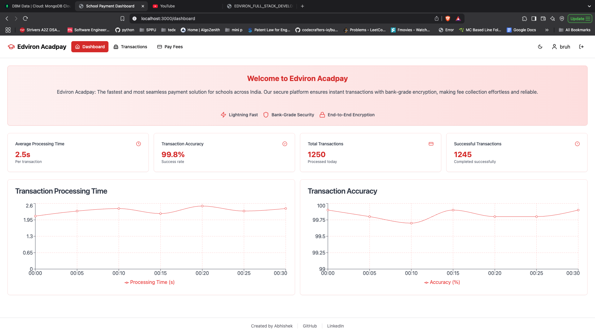
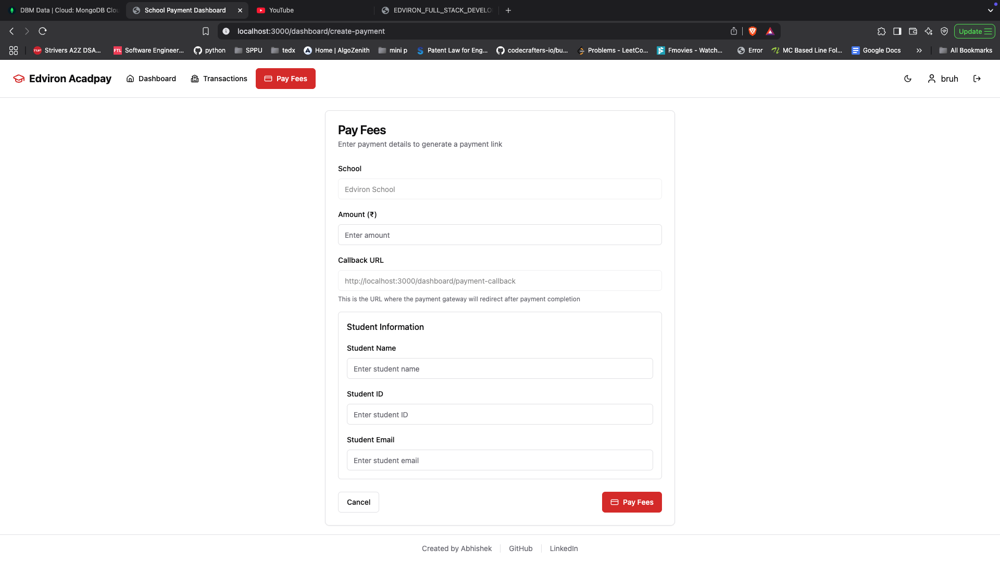
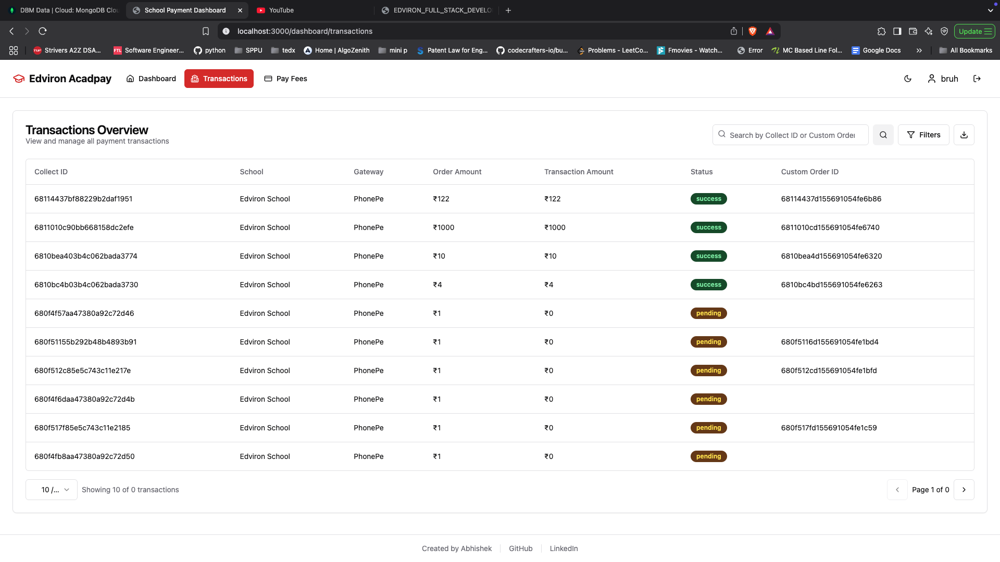
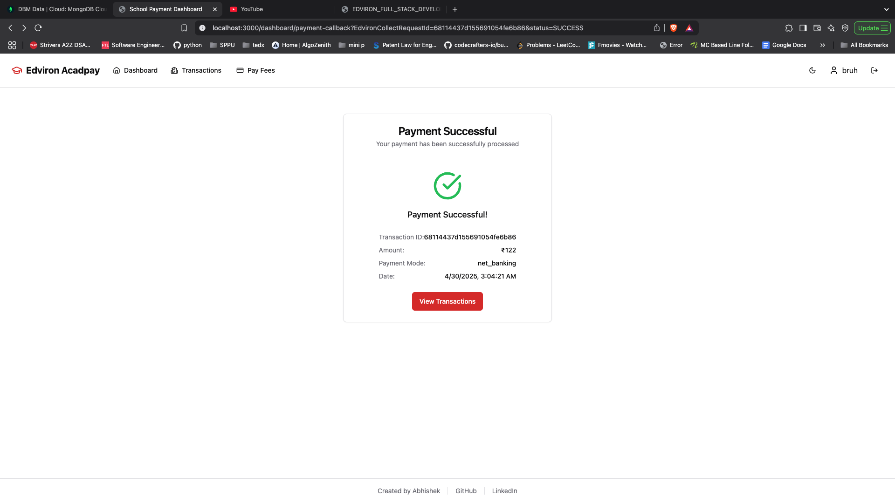

# Edviron Acadpay - School Payment Dashboard

A modern, user-friendly dashboard for managing school payments and transactions. Built with Next.js, TypeScript, and Tailwind CSS.



## Table of Contents

- [Edviron Acadpay - School Payment Dashboard](#edviron-acadpay---school-payment-dashboard)
  - [Table of Contents](#table-of-contents)
  - [Features](#features)
  - [Tech Stack](#tech-stack)
  - [Getting Started](#getting-started)
    - [Prerequisites](#prerequisites)
    - [Installation](#installation)
    - [Environment Variables](#environment-variables)
    - [Running the Application](#running-the-application)
  - [Project Structure](#project-structure)
  - [Screenshots](#screenshots)
    - [Dashboard](#dashboard)
    - [Pay Fees](#pay-fees)
    - [Transactions](#transactions)
    - [Payment Callback](#payment-callback)
  - [Page Documentation](#page-documentation)
    - [Dashboard](#dashboard-1)
    - [Pay Fees](#pay-fees-1)
    - [Transactions](#transactions-1)
    - [Payment Callback](#payment-callback-1)
  - [API Integration](#api-integration)
  - [Styling and UI Components](#styling-and-ui-components)
  - [Contributing](#contributing)
  - [License](#license)

## Features

- **Modern UI**: Clean, responsive interface built with Tailwind CSS
- **Payment Processing**: Seamless integration with payment gateways
- **Transaction Management**: View, filter, and search transactions
- **School Management**: Dedicated interface for school payment processing
- **Real-time Updates**: Instant feedback on payment status
- **Secure Authentication**: Protected routes and secure data handling

## Tech Stack

- **Frontend**: Next.js, React, TypeScript
- **Styling**: Tailwind CSS, Shadcn UI
- **State Management**: React Hooks
- **API Integration**: Axios
- **Authentication**: NextAuth.js
- **Deployment**: Vercel (recommended)

## Getting Started

### Prerequisites

- Node.js (v14 or higher)
- npm or yarn
- Git

### Installation

1. Clone the repository:
   ```bash
   git clone https://github.com/yourusername/edviron-acadpay.git
   cd edviron-acadpay
   ```

2. Install dependencies:
   ```bash
   npm install
   # or
   yarn install
   ```

3. Set up environment variables (see [Environment Variables](#environment-variables))

4. Run the development server:
   ```bash
   npm run dev
   # or
   yarn dev
   ```

5. Open [http://localhost:3000](http://localhost:3000) in your browser

### Environment Variables

Create a `.env.local` file in the root directory with the following variables:

```
NEXT_PUBLIC_API_URL=https://api.edviron.com
NEXT_PUBLIC_SCHOOL_ID=65b0e6293e9f76a9694d84b4
```

### Running the Application

- **Development**: `npm run dev` or `yarn dev`
- **Production Build**: `npm run build` or `yarn build`
- **Start Production**: `npm start` or `yarn start`
- **Lint**: `npm run lint` or `yarn lint`

## Project Structure

```
edviron-acadpay/
├── app/                    # Next.js app directory
│   ├── api/                # API routes
│   ├── dashboard/          # Dashboard pages
│   │   ├── create-payment/ # Pay fees page
│   │   ├── transactions/   # Transactions page
│   │   ├── payment-callback/ # Payment callback page
│   │   ├── layout.tsx      # Dashboard layout
│   │   └── page.tsx        # Dashboard home
│   ├── auth/               # Authentication pages
│   ├── layout.tsx          # Root layout
│   └── page.tsx            # Landing page
├── components/             # Reusable components
│   ├── ui/                 # UI components
│   └── ...                 # Other components
├── lib/                    # Utility functions and services
│   ├── services/           # API services
│   └── utils/              # Helper functions
├── public/                 # Static assets
├── screenshots/            # Application screenshots
├── styles/                 # Global styles
├── .env.local              # Environment variables
├── next.config.js          # Next.js configuration
├── package.json            # Dependencies
├── tailwind.config.js      # Tailwind CSS configuration
└── tsconfig.json           # TypeScript configuration
```

## Screenshots

### Dashboard

*Main dashboard with transaction statistics and charts*

### Pay Fees

*Payment form for school fees*

### Transactions

*Transaction listing with filtering options*

### Payment Callback

*Payment confirmation page*

## Page Documentation

### Dashboard

**Path**: `/dashboard`

The main dashboard provides an overview of payment statistics and recent transactions.

**Features**:
- Summary cards showing total transactions, total amount, and success rate
- Transaction status distribution chart
- Recent transactions table
- Quick access to payment and transaction pages

**Components**:
- `DashboardPage`: Main component rendering the dashboard
- `StatCard`: Displays key metrics
- `TransactionChart`: Visualizes transaction status distribution
- `RecentTransactions`: Shows latest transactions

### Pay Fees

**Path**: `/dashboard/create-payment`

This page allows users to create new payment requests for school fees.

**Features**:
- School selection (currently set to Edviron School)
- Amount input with validation
- Student information collection
- Payment gateway integration

**Components**:
- `CreatePaymentPage`: Main component for payment creation
- `PaymentForm`: Form for collecting payment details
- `StudentInfoSection`: Section for student information

**Flow**:
1. User enters payment amount
2. User provides student information
3. System generates payment link
4. User is redirected to payment gateway
5. After payment, user is redirected to callback URL

### Transactions

**Path**: `/dashboard/transactions`

This page displays all transactions with filtering and search capabilities.

**Features**:
- Transaction listing with pagination
- Filtering by status and school
- Search functionality
- Sorting by various columns
- Export functionality

**Components**:
- `TransactionsPage`: Main component for transaction management
- `TransactionTable`: Displays transaction data
- `FilterPopover`: Contains filter options
- `Pagination`: Controls for navigating through pages

**Filtering Options**:
- Status: Success, Pending, Failed
- School: Edviron School
- Search: By Collect ID or Custom Order ID

### Payment Callback

**Path**: `/dashboard/payment-callback`

This page handles the redirect from the payment gateway after a transaction is completed.

**Features**:
- Payment status verification
- Transaction details display
- Receipt generation
- Return to dashboard option

**Components**:
- `PaymentCallbackPage`: Main component for payment callback
- `PaymentStatus`: Displays payment status
- `TransactionDetails`: Shows transaction information

## API Integration

The application integrates with the Edviron API for payment processing and transaction management.

**Services**:
- `paymentService`: Handles payment creation and verification
- `transactionService`: Manages transaction retrieval and filtering

**Endpoints**:
- `POST /api/payments`: Create a new payment
- `GET /api/transactions`: Retrieve transactions
- `GET /api/transactions/:id`: Get transaction details
- `GET /api/schools/:id/transactions`: Get school-specific transactions

## Styling and UI Components

The application uses Tailwind CSS for styling and Shadcn UI for components.

**Key Components**:
- Cards
- Tables
- Forms
- Buttons
- Badges
- Popovers
- Alerts

**Theme**:
- Light and dark mode support
- Consistent color scheme
- Responsive design for all screen sizes

## Contributing

1. Fork the repository
2. Create your feature branch (`git checkout -b feature/amazing-feature`)
3. Commit your changes (`git commit -m 'Add some amazing feature'`)
4. Push to the branch (`git push origin feature/amazing-feature`)
5. Open a Pull Request

## License

This project is licensed under the MIT License - see the LICENSE file for details. 